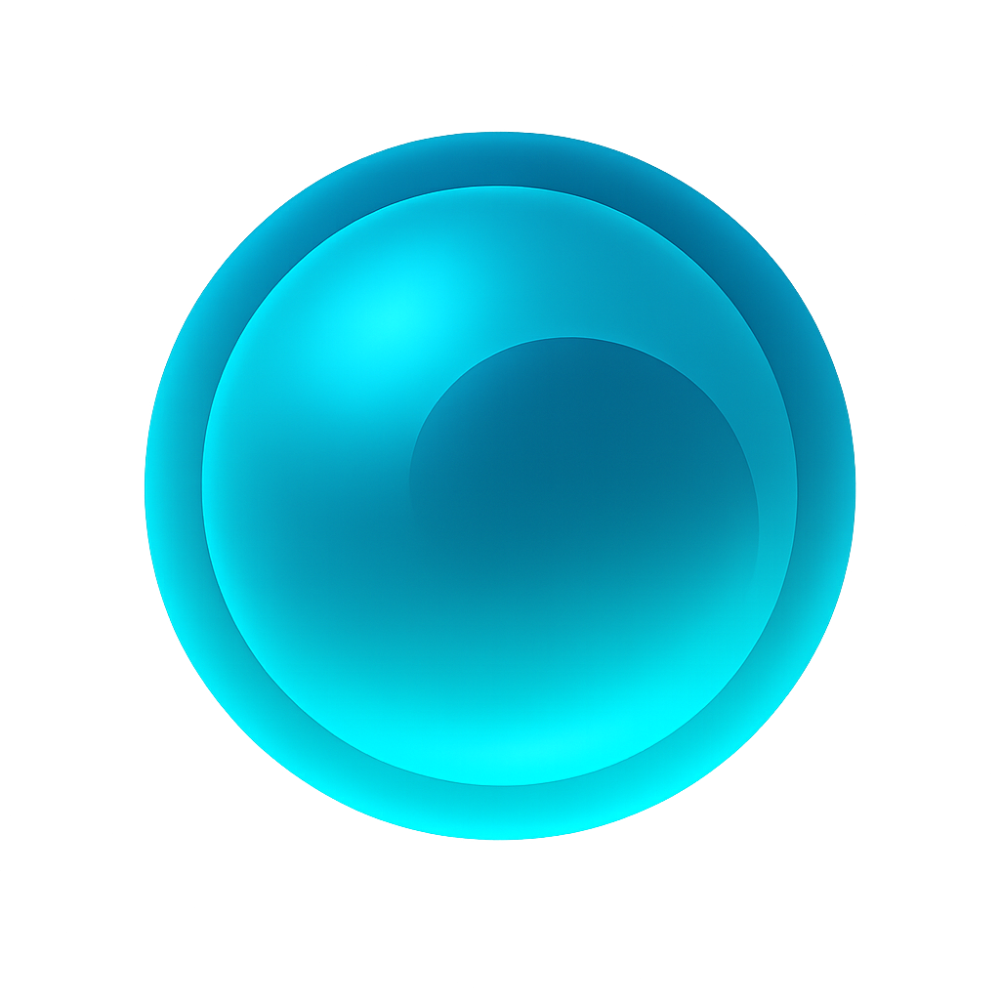

<div align="center">
  
  <h1>Materia</h1>
  <p><strong>Kotlin Multiplatform 3D Engine</strong></p>
  <p>Modern rendering toolkit targeting WebGPU, Vulkan, and emerging XR surfaces with Three.js-style ergonomics.</p>
  
  <br/>
  
  > ⚠️ **Alpha Software** – Materia is under active development. APIs may change between releases. Not recommended for production use yet.
</div>

<p align="center">
  <a href="https://kotlinlang.org/docs/multiplatform.html">
    
  </a>
  <a href="https://kotlinlang.org/docs/multiplatform.html">
    
  </a>
  <a href="LICENSE">
    
  </a>
  
</p>

<p align="center">
  <strong><a href="https://x.com/deepissuemassaj">Follow development on X: @deepissuemassaj</a></strong>
</p>

---

## ✨ Highlights

- **Unified Rendering API** – Write once, render everywhere with expect/actual abstractions over WebGPU, Vulkan (LWJGL), and Metal (MoltenVK)
- **Three.js-Style API** – Familiar scene graph, materials, cameras, controls, and lighting patterns for easy adoption
- **Performance-First** – Arena allocators, uniform ring buffers, GPU resource pooling, and automatic instancing
- **Comprehensive Loaders** – GLTF 2.0, OBJ, FBX, Collada, PLY, STL, DRACO, KTX2, HDR/EXR textures, fonts
- **Full Controls Suite** – OrbitControls, FlyControls, PointerLockControls, TrackballControls, DragControls, TransformControls
- **Debug Helpers** – AxesHelper, GridHelper, BoxHelper, ArrowHelper, CameraHelper, light helpers
- **Cross-Platform Audio** – Positional audio and analyser abstractions aligned with the camera system
- **Production Ready** – Built-in validation, Kover coverage, and dependency scanning pipelines

---

## 🗺️ Feature Map

There is still no perfect 1:1 Kotlin equivalent of `three.js`. `materia` is aiming at that gap: a scene-first Kotlin Multiplatform engine with three.js-style ergonomics, modern GPU backends, and a broad built-in runtime surface.

| Stack | Primary fit | Platform / backend story | Authoring model | 3D Surface | Distinctive strength |
|--------|-------------|--------------------------|-----------------|------------|----------------------|
| **Materia** | Kotlin Multiplatform scene-first 3D apps and engines | WebGPU + WebGL2 fallback on web, Vulkan on JVM/Android, MoltenVK on Apple beta | **High-level** scene graph with three.js-style APIs | PBR, shadows, instancing, LOD, broad loaders, controls, audio, post, volume textures, early XR | Tries to pair three.js-style ergonomics with real KMP backend reach |
| **three.js** | Browser-first general-purpose 3D | WebGL + WebGPU plus CSS/SVG renderers | **Highest-level** scene-first API | Huge materials, loaders, post, XR, editor, examples | The reference point for breadth, docs, and examples |
| **kool** | Modern Kotlin renderer / engine | Vulkan, WebGPU, and OpenGL across desktop, browser, and Android | More engine-like than scene-first | PBR, glTF, shadows, SSAO/SSR/bloom, deferred, compute demos | Broadest modern backend spread in the Kotlin ecosystem |
| **Korender** | Lightweight KMP scene rendering | Desktop OpenGL 3.3, Android OpenGL ES 3, WebGL 2 | Declarative and close in spirit to three.js | PBR, shadows, glTF/OBJ, instancing, terrain, shaders | Closest public KMP peer in authoring style |
| **scenery** | Scientific visualization, VR, and volume rendering on the JVM | OpenGL 4.1 + Vulkan on JVM | Scene graph, but domain-specialized | Volume rendering, stereo pipelines, OpenVR/SteamVR | Best fit for lab / scientific / immersive workloads |
| **OPENRNDR + ORX** | Creative coding, realtime graphics tools, installations | Desktop-first OpenGL with experimental browser support | Programmable graphics toolkit first | Compositor, effects, ORX cameras, loaders, scene helpers | Best workflow for generative and custom visual tools |
| **libGDX + KTX** | Kotlin game development and cross-platform game/tool stacks | Broad cross-platform OpenGL-family game framework | Framework-oriented rather than scene-first | Solid 3D core, especially with `gdx-gltf` and PBR extensions | Most established Kotlin game ecosystem |

`materia` is still alpha, so this is best read as a positioning map rather than a maturity ranking. Today the shared JS/JVM/Android path is the strongest, while Apple and XR support are earlier than the core scene, material, loader, and rendering stack.

---

## 🎯 Platform Support

| Platform | Backend | Status |
|----------|---------|--------|
| **Browser (JS/WASM)** | WebGPU (WebGL2 fallback) | ✅ Ready |
| **JVM (Linux/macOS/Windows)** | Vulkan via LWJGL 3.3.6 | ✅ Ready |
| **Android** | Vulkan (API 24+) | ✅ Ready |
| **Native Apple (macOS/iOS)** | MoltenVK | 🟡 Beta |

---

<!-- benchmark:begin -->
## 📊 Benchmarks

These numbers are measured on a specific reference machine and should be read as **environment-specific samples**, not universal guarantees.

- Methodology: 1920x1080 output, 120 warmup frames, 600 measured frames, and 3 repeats per scene/platform. Frame metrics use wall-clock timings around each render iteration. Heap values are deltas from the platform-reported heap baseline captured before scene boot.
- Frame metrics are CPU-side wall-clock timings around each render iteration, not GPU timestamp queries.
- Raw benchmark captures live in `docs/benchmarks/data/raw/`, and the aggregated snapshot lives in `docs/benchmarks/data/latest.json`.

| Scene | Platform | Workload | Boot to First Frame | Avg FPS | P95 Frame | Peak Heap Delta | Notes |
|-------|----------|----------|---------------------|---------|-----------|-----------------|-------|
| Triangle | JVM | Default triangle scene | 437.15 ms | 164.75 | 6.29 ms | 41.0 MB | VULKAN, Single-scene baseline, Hidden GLFW surface |
| Triangle | Web | Default triangle scene | 2393.03 ms | 22261.74 | 0.2 ms | 1.65 MB | WEBGPU, Chrome 147.0.7727.55, Single-scene baseline, Chrome automation benchmark |
| Triangle | Android | Default triangle scene | 215.36 ms | 58.92 | 16.67 ms | 39.2 MB | OPENGL, emulator, Single-scene baseline, Filament OpenGL path |
| Embedding Galaxy | JVM | 20,000 points / Balanced | 403.04 ms | 165.09 | 6.22 ms | 43.0 MB | VULKAN, Instanced point cloud, Balanced quality |
| Embedding Galaxy | Web | 20,000 points / Balanced | 2621.5 ms | 9737.31 | 0.2 ms | 11.16 MB | WEBGPU, Chrome 147.0.7727.55, Instanced point cloud, Balanced quality |
| Embedding Galaxy | Android | 20,000 points / Balanced | 727.99 ms | 56.68 | 16.67 ms | 67.96 MB | VULKAN, emulator, Instanced point cloud, Balanced quality |
| Force Graph | JVM | 2,500 nodes / 7,500 edges / default mode | 418.94 ms | 163.97 | 6.2 ms | 29.0 MB | VULKAN, Default baked dataset, Default mode is TF-IDF |
| Force Graph | Web | 2,500 nodes / 7,500 edges / default mode | 2591.47 ms | 19642.98 | 0.2 ms | 7.05 MB | WEBGPU, Chrome 147.0.7727.55, Default baked dataset, Default mode is TF-IDF |
| Force Graph | Android | 2,500 nodes / 7,500 edges / default mode | 848.64 ms | 59.29 | 16.67 ms | 77.73 MB | VULKAN, emulator, Default baked dataset, Default mode is TF-IDF |

Reference environment:
- JVM: Linux 6.18.21-1-cachyos-lts, Java 22.0.2, VULKAN on NVIDIA GeForce RTX 4090
- Web: Chrome 147.0.7727.55, WEBGPU on Adapter name unavailable
- Android: Pixel_9_Pro (sdk_gphone16k_x86_64), OPENGL, emulator / host-GPU-assisted result

Synthetic contract tests in the repo still exist for validation and guardrails, but the README table above is sourced only from these measured benchmark captures.
<!-- benchmark:end -->

---

## 🚀 Quick Start

### Prerequisites

- JDK 17+
- Node.js ≥ 18 (for JS target)
- Android SDK API 34 (for Android target)
- Xcode 15+ with Metal-capable simulator/device (for Apple beta targets)
- Vulkan drivers or WebGPU-enabled browser

### Build

```bash
git clone https://github.com/codeyousef/Materia.git
cd Materia

# Build all targets
./gradlew build

# Run tests
./gradlew test

# Generate coverage report
./gradlew koverHtmlReport
```

---

## 📦 Examples

Run the Gradle-based examples directly, or open the Apple host apps in Xcode:

```bash
# Triangle demo
./gradlew :examples:triangle:runJvm          # Desktop
./gradlew :examples:triangle:jsBrowserRun    # Browser
./gradlew :examples:triangle:runMacos        # Apple Native (macOS host only)
open examples/triangle-ios-app/MateriaTriangleDemo.xcodeproj  # Native iOS host app

# Volume texture demo
./gradlew :examples:volume-texture:runJvm    # Desktop
./gradlew :examples:volume-texture:jsBrowserRun
open examples/volume-texture-ios-app/MateriaVolumeTextureDemo.xcodeproj  # iOS Simulator / My Mac (Mac Catalyst)

# Embedding Galaxy (particle visualization)
./gradlew :examples:embedding-galaxy:runJvm

# Force Graph (network visualization)  
./gradlew :examples:force-graph:runJvm
```

**Browser Requirements:** Chrome 113+, Edge 113+, or Firefox Nightly with WebGPU enabled.

**Android:** Connect a device/emulator with Vulkan support, then run `:examples:triangle-android:installDebug`.

**Apple Beta:** The active shared modules and example modules compile for `iosArm64`, `iosX64`, `iosSimulatorArm64`, `macosArm64`, and `macosX64`. The current runtime model is split:
- `:examples:triangle` exercises the shared Apple engine path. `./gradlew :examples:triangle:runMacos` launches the macOS native executable, and `examples/triangle-ios-app/MateriaTriangleDemo.xcodeproj` hosts the exported `MateriaTriangle` framework on iOS.
- `examples:volume-texture` still uses the legacy root `RendererFactory` API. The current working Apple path is `examples/volume-texture-ios-app/MateriaVolumeTextureDemo.xcodeproj`, which packages the generated JS/WebGL bundle for iOS Simulator and `My Mac (Mac Catalyst)`.

---

## 🏗️ Project Structure

```
materia-engine/         # Core: scene graph, materials, animation
materia-gpu/            # GPU abstraction: WebGPU/Vulkan backends
materia-postprocessing/ # Post-processing effects pipeline
materia-validation/     # Production readiness validation CLI
examples/               # Multiplatform example applications
docs/                   # API reference and guides
```

---

## 📖 Documentation

- [Getting Started Guide](docs/guides/getting-started.md)
- [Volume Texture Guide](docs/guides/volume-textures.md)
- [API Reference](docs/api-reference/README.md)
- [Architecture Overview](docs/architecture/overview.md)
- [Platform-Specific Notes](docs/guides/platform-specific.md)

---

## 🔧 Development

### Quality Gates

```bash
./gradlew build                       # Compile + tests
./gradlew koverVerify                 # Coverage check (50% minimum)
./gradlew lintDebug                   # Android lint
./gradlew dependencyCheckAnalyze      # Security audit
./gradlew validateProductionReadiness # Full validation suite
```

### Shader Compilation

The project uses dual shader sources:
- **WebGPU (JS):** WGSL strings in Kotlin code
- **Vulkan (JVM):** Pre-compiled SPIR-V in `src/jvmMain/resources/shaders/`

Run `./gradlew compileShaders` to regenerate SPIR-V from WGSL sources.

---

## 🤝 Contributing

Contributions welcome! Please:

1. Fork and create a feature branch
2. Add tests for new functionality
3. Run quality gates before submitting
4. Open a PR with clear description

See [CONTRIBUTING.md](CONTRIBUTING.md) for detailed guidelines.

---

## � Built With

Materia is built on top of these excellent open source projects:

- **[wgpu4k](https://github.com/AmphoraHealth/wgpu4k)** – Kotlin Multiplatform bindings for wgpu, providing the unified WebGPU/Vulkan graphics backend
- **[korlibs-math](https://github.com/korlibs/korge)** – Kotlin Multiplatform math library from Korge, providing vectors, matrices, and quaternions

---

## �📄 License

[Apache License 2.0](LICENSE) – Use freely in commercial and open source projects.

---

<p align="center">
  <sub>Built with ❤️ using Kotlin Multiplatform</sub>
</p>
