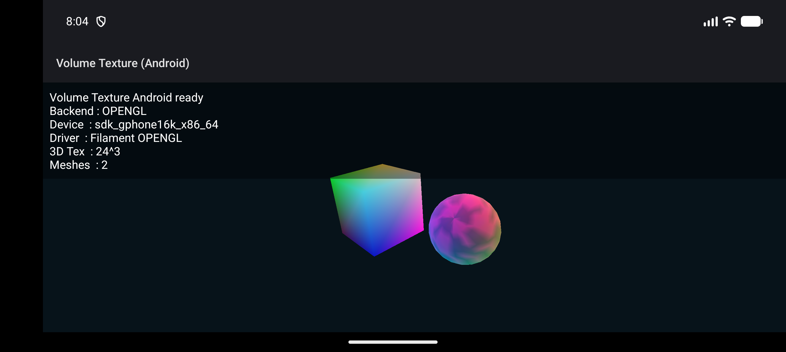

# Volume Textures

`Data3DTexture` is the built-in volume texture type for voxel data, density fields, and procedural 3D color volumes.

## Basic Usage

```kotlin
import io.materia.core.math.Color
import io.materia.core.scene.Mesh
import io.materia.geometry.primitives.BoxGeometry
import io.materia.material.MeshBasicMaterial
import io.materia.texture.Data3DTexture

val volume = Data3DTexture.createNoise(
    width = 32,
    height = 32,
    depth = 32,
    seed = 42,
    amplitude = 1f
)

val material = MeshBasicMaterial().apply {
    color = Color.WHITE
    map = volume
}

// A 2x2x2 box keeps local positions in the [-1, 1] range used by the built-in volume sampler.
val mesh = Mesh(BoxGeometry(2f, 2f, 2f), material)
scene.add(mesh)
```

## Backend Behavior

- JS WebGPU: uploads `Data3DTexture` as a real GPU 3D texture and samples it in the fragment shader.
- JVM Vulkan: uploads `Data3DTexture` as a real Vulkan 3D image and samples it in the fragment shader.
- Android renderer: uses a CPU fallback that samples the volume in local space and bakes the result into mesh vertex colors.
- WebGL fallback: uses the same CPU fallback as Android and bakes sampled volume colors into mesh vertex colors.
- Apple example path: the current runnable Apple `volume-texture` example is `examples/volume-texture-ios-app/MateriaVolumeTextureDemo.xcodeproj`, which packages the generated JS/WebGL build inside a native iOS / Mac Catalyst shell because the native Apple `RendererFactory` path for this API is still stubbed.

## Runnable Example

- Desktop: `./gradlew :examples:volume-texture:runJvm`
- Browser: `./gradlew :examples:volume-texture:jsBrowserRun`
- Android: `./gradlew :examples:volume-texture-android:runAndroid`
- Apple: `open examples/volume-texture-ios-app/MateriaVolumeTextureDemo.xcodeproj`

## Apple Runtime Note

The shared `VolumeTextureExample` still uses the older root `RendererFactory` API. On Apple platforms, that renderer path does not yet draw scene content natively, so the current Apple run path is the wrapper app at `examples/volume-texture-ios-app/`.

That Xcode project rebuilds the JS bundle during app builds and loads it through `WKWebView` on iOS and `My Mac (Mac Catalyst)`, which keeps the shared `Data3DTexture` scene runnable on both Apple targets while the native renderer catches up.

## Android Reference Capture

The current Android wrapper renders the shared volume-texture scene through the Filament/OpenGL fallback path.



## Coordinate Mapping

The built-in material path samples `MeshBasicMaterial.map = Data3DTexture` from centered local mesh coordinates:

```text
sampleCoord = clamp(localPosition * 0.5 + 0.5, 0.0, 1.0)
```

That means geometry centered around the origin and spanning roughly `[-1, 1]` on each axis gives the most intuitive results.

## Notes

- The current built-in volume consumer is `MeshBasicMaterial.map`.
- Android and WebGL fallbacks currently use nearest-voxel CPU sampling rather than GPU filtering.
- If you need custom transfer functions or ray marching, use a custom shader path instead of the built-in basic material.
