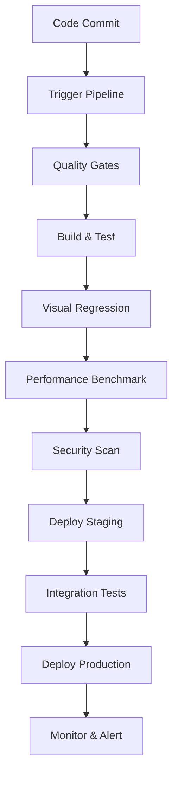

# Materia Tools - CI/CD Integration Example

This sample demonstrates how to integrate Materia development tools into continuous integration and
deployment pipelines, enabling automated testing, quality assurance, and deployment workflows.

## Overview

This example shows how to:

- Set up automated testing with Materia tools
- Integrate visual regression testing
- Implement performance benchmarking in CI
- Automate asset validation and optimization
- Deploy tools and applications automatically
- Monitor production performance

## Prerequisites

- Docker and Docker Compose
- Jenkins, GitHub Actions, or GitLab CI
- Materia Tools installed
- Access to target deployment environments

## Project Structure

```
samples/cicd-integration/
├── README.md
├── docker/
│   ├── Dockerfile.tools
│   ├── Dockerfile.test-runner
│   ├── Dockerfile.asset-processor
│   └── docker-compose.yml
├── ci/
│   ├── github-actions/
│   │   ├── build-and-test.yml
│   │   ├── visual-regression.yml
│   │   ├── performance-benchmark.yml
│   │   └── deploy-production.yml
│   ├── gitlab-ci/
│   │   ├── .gitlab-ci.yml
│   │   ├── test-matrix.yml
│   │   └── deployment.yml
│   ├── jenkins/
│   │   ├── Jenkinsfile
│   │   ├── test-pipeline.groovy
│   │   └── deployment-pipeline.groovy
│   └── azure-devops/
│       ├── azure-pipelines.yml
│       └── deployment-templates/
├── scripts/
│   ├── ci/
│   │   ├── setup-environment.sh
│   │   ├── run-tests.sh
│   │   ├── validate-assets.sh
│   │   ├── performance-benchmark.sh
│   │   └── deploy.sh
│   ├── quality/
│   │   ├── code-quality.sh
│   │   ├── security-scan.sh
│   │   └── dependency-check.sh
│   └── monitoring/
│       ├── health-check.sh
│       ├── performance-monitor.sh
│       └── alert-handler.sh
├── config/
│   ├── quality-gates.json
│   ├── benchmark-thresholds.json
│   ├── deployment-config.json
│   └── monitoring-config.json
├── tests/
│   ├── integration/
│   │   ├── ToolsIntegrationTest.kt
│   │   ├── PipelineValidationTest.kt
│   │   └── DeploymentSmokeTest.kt
│   ├── visual/
│   │   ├── VisualRegressionSuite.kt
│   │   └── baseline-images/
│   ├── performance/
│   │   ├── BenchmarkSuite.kt
│   │   ├── LoadTestRunner.kt
│   │   └── MemoryLeakDetector.kt
│   └── e2e/
│       ├── UserWorkflowTest.kt
│       └── ToolInteractionTest.kt
└── docs/
    ├── CI-CD-SETUP.md
    ├── PIPELINE-CONFIGURATION.md
    ├── MONITORING.md
    └── TROUBLESHOOTING.md
```

## CI/CD Pipeline Architecture



## Pipeline Configurations

### GitHub Actions Workflow

```yaml
# ci/github-actions/build-and-test.yml
name: Materia Tools CI/CD

on:
  push:
    branches: [main, develop]
  pull_request:
    branches: [main]
  schedule:
    - cron: '0 2 * * *'  # Daily builds

env:
  MATERIA_VERSION: ${{ github.sha }}
  DOCKER_REGISTRY: ghcr.io
  JAVA_VERSION: 17
  NODE_VERSION: 18

jobs:
  quality-gates:
    runs-on: ubuntu-latest
    outputs:
      should-deploy: ${{ steps.quality-check.outputs.deploy }}
    steps:
      - uses: actions/checkout@v4
        with:
          fetch-depth: 0

      - name: Setup Java
        uses: actions/setup-java@v4
        with:
          java-version: ${{ env.JAVA_VERSION }}
          distribution: 'temurin'

      - name: Run quality gates
        run: |
          chmod +x scripts/quality/code-quality.sh
          ./scripts/quality/code-quality.sh

      - name: Security scan
        run: |
          chmod +x scripts/quality/security-scan.sh
          ./scripts/quality/security-scan.sh

      - name: Quality gate decision
        id: quality-check
        run: |
          if [[ "${{ github.ref }}" == "refs/heads/main" ]]; then
            echo "deploy=true" >> $GITHUB_OUTPUT
          else
            echo "deploy=false" >> $GITHUB_OUTPUT
          fi

  build-and-test:
    runs-on: ${{ matrix.os }}
    needs: quality-gates
    strategy:
      matrix:
        os: [ubuntu-latest, windows-latest, macos-latest]
        platform: [jvm, js, android]
        exclude:
          - os: windows-latest
            platform: android
          - os: macos-latest
            platform: android

    steps:
      - uses: actions/checkout@v4

      - name: Setup Environment
        run: |
          chmod +x scripts/ci/setup-environment.sh
          ./scripts/ci/setup-environment.sh

      - name: Build Tools
        run: |
          ./gradlew :tools:editor:assemble
          ./gradlew :tools:profiler:assemble
          ./gradlew :tools:api-server:shadowJar

      - name: Run Tests
        run: |
          chmod +x scripts/ci/run-tests.sh
          ./scripts/ci/run-tests.sh --platform=${{ matrix.platform }}

      - name: Upload test results
        uses: actions/upload-artifact@v3
        if: always()
        with:
          name: test-results-${{ matrix.os }}-${{ matrix.platform }}
          path: |
            build/test-results/
            build/reports/

  visual-regression:
    runs-on: ubuntu-latest
    needs: build-and-test
    if: github.event_name == 'pull_request'

    steps:
      - uses: actions/checkout@v4

      - name: Setup Environment
        run: ./scripts/ci/setup-environment.sh

      - name: Run Visual Regression Tests
        run: |
          # Setup virtual display
          export DISPLAY=:99
          Xvfb :99 -screen 0 1920x1080x24 &

          # Run visual tests
          ./gradlew visualRegressionTest

      - name: Upload visual diff reports
        uses: actions/upload-artifact@v3
        if: failure()
        with:
          name: visual-regression-diffs
          path: build/reports/visual-regression/

  performance-benchmark:
    runs-on: ubuntu-latest
    needs: build-and-test

    steps:
      - uses: actions/checkout@v4

      - name: Setup Environment
        run: ./scripts/ci/setup-environment.sh

      - name: Run Performance Benchmarks
        run: |
          chmod +x scripts/ci/performance-benchmark.sh
          ./scripts/ci/performance-benchmark.sh

      - name: Analyze Performance Results
        run: |
          ./gradlew analyzePerformanceRegression

      - name: Comment on PR
        if: github.event_name == 'pull_request'
        uses: actions/github-script@v6
        with:
          script: |
            const fs = require('fs');
            const reportPath = 'build/reports/performance/summary.json';
            if (fs.existsSync(reportPath)) {
              const report = JSON.parse(fs.readFileSync(reportPath, 'utf8'));
              const comment = `
              ## Performance Benchmark Results 📊

              | Metric | Current | Previous | Change |
              |--------|---------|----------|--------|
              | Frame Rate | ${report.fps}fps | ${report.previousFps}fps | ${report.fpsChange} |
              | Load Time | ${report.loadTime}ms | ${report.previousLoadTime}ms | ${report.loadTimeChange} |
              | Memory Usage | ${report.memoryUsage}MB | ${report.previousMemoryUsage}MB | ${report.memoryChange} |

              ${report.regression ? '⚠️ **Performance regression detected!**' : '✅ **No performance regression**'}
              `;

              github.rest.issues.createComment({
                issue_number: context.issue.number,
                owner: context.repo.owner,
                repo: context.repo.repo,
                body: comment
              });
            }

  deploy-staging:
    runs-on: ubuntu-latest
    needs: [quality-gates, build-and-test, performance-benchmark]
    if: needs.quality-gates.outputs.should-deploy == 'true'
    environment: staging

    steps:
      - uses: actions/checkout@v4

      - name: Build Docker Images
        run: |
          docker build -f docker/Dockerfile.tools -t ${{ env.DOCKER_REGISTRY }}/materia-tools:${{ github.sha }} .
          docker build -f docker/Dockerfile.asset-processor -t ${{ env.DOCKER_REGISTRY }}/asset-processor:${{ github.sha }} .

      - name: Deploy to Staging
        run: |
          chmod +x scripts/ci/deploy.sh
          ./scripts/ci/deploy.sh staging

      - name: Run Integration Tests
        run: |
          ./gradlew integrationTest --environment=staging

  deploy-production:
    runs-on: ubuntu-latest
    needs: deploy-staging
    if: github.ref == 'refs/heads/main'
    environment: production

    steps:
      - uses: actions/checkout@v4

      - name: Deploy to Production
        run: |
          chmod +x scripts/ci/deploy.sh
          ./scripts/ci/deploy.sh production

      - name: Health Check
        run: |
          chmod +x scripts/monitoring/health-check.sh
          ./scripts/monitoring/health-check.sh

      - name: Setup Monitoring
        run: |
          chmod +x scripts/monitoring/performance-monitor.sh
          ./scripts/monitoring/performance-monitor.sh --start
```

### Docker Configuration

```dockerfile
# docker/Dockerfile.tools
FROM openjdk:17-jdk-slim

# Install Node.js for web tools
RUN curl -fsSL https://deb.nodesource.com/setup_18.x | bash - && \
    apt-get install -y nodejs

# Install system dependencies
RUN apt-get update && apt-get install -y \
    libx11-6 libxext6 libxi6 libxrender1 libxtst6 \
    xvfb curl wget git \
    && rm -rf /var/lib/apt/lists/*

WORKDIR /app

# Copy application
COPY build/libs/ ./libs/
COPY tools/ ./tools/
COPY scripts/ ./scripts/

# Setup environment
RUN chmod +x scripts/ci/setup-environment.sh && \
    ./scripts/ci/setup-environment.sh

# Expose ports
EXPOSE 8080 3000

# Health check
HEALTHCHECK --interval=30s --timeout=10s --start-period=60s --retries=3 \
    CMD curl -f http://localhost:8080/health || exit 1

CMD ["java", "-jar", "libs/materia-api-server-all.jar"]
```

```dockerfile
# docker/Dockerfile.test-runner
FROM openjdk:17-jdk

# Install testing dependencies
RUN apt-get update && apt-get install -y \
    xvfb chromium-browser firefox-esr \
    imagemagick ffmpeg \
    && rm -rf /var/lib/apt/lists/*

WORKDIR /test

COPY build/test-libs/ ./libs/
COPY tests/ ./tests/
COPY scripts/ci/ ./scripts/

# Setup test environment
RUN chmod +x scripts/setup-environment.sh && \
    ./scripts/setup-environment.sh

CMD ["./scripts/run-tests.sh"]
```

## Automated Testing Scripts

### Test Execution Script

```bash
#!/bin/bash
# scripts/ci/run-tests.sh

set -e

PLATFORM=${1:-"all"}
ENVIRONMENT=${2:-"ci"}

echo "Running tests for platform: $PLATFORM in environment: $ENVIRONMENT"

# Setup test environment
case $ENVIRONMENT in
    "ci")
        export DISPLAY=:99
        Xvfb :99 -screen 0 1920x1080x24 > /dev/null 2>&1 &
        ;;
    "docker")
        export DISPLAY=:0
        ;;
esac

# Run platform-specific tests
case $PLATFORM in
    "jvm")
        ./gradlew jvmTest
        ;;
    "js")
        ./gradlew jsTest
        ;;
    "android")
        ./gradlew testDebugUnitTest
        ;;
    "all")
        ./gradlew test
        ;;
esac

# Run tool-specific tests
./gradlew :tools:editor:test
./gradlew :tools:profiler:test
./gradlew :tools:api-server:test

# Run integration tests
./gradlew integrationTest

# Visual regression tests (Linux only)
if [[ "$OSTYPE" == "linux-gnu"* ]] && [[ "$PLATFORM" != "android" ]]; then
    ./gradlew visualRegressionTest
fi

# Performance tests
./gradlew performanceTest

echo "All tests completed successfully"
```

### Performance Benchmarking

```bash
#!/bin/bash
# scripts/ci/performance-benchmark.sh

set -e

echo "Running performance benchmarks..."

# Ensure clean environment
./gradlew clean build

# Run comprehensive benchmarks
./gradlew :tools:tests:performanceBenchmark \
    --rerun-tasks \
    --profile \
    --info

# Analyze results
./gradlew analyzePerformanceResults

# Generate report
./gradlew generatePerformanceReport --format=json

# Check for regressions
if ./gradlew checkPerformanceRegression; then
    echo "✅ No performance regressions detected"
else
    echo "⚠️  Performance regression detected!"
    exit 1
fi
```

### Asset Validation

```bash
#!/bin/bash
# scripts/ci/validate-assets.sh

set -e

echo "Validating project assets..."

# Check asset formats
find assets/ -name "*.gltf" -exec echo "Validating GLTF: {}" \; -exec gltf-validator {} \;
find assets/ -name "*.png" -exec echo "Validating PNG: {}" \; -exec pngcheck {} \;
find assets/ -name "*.jpg" -exec echo "Validating JPEG: {}" \; -exec jpeginfo -c {} \;

# Check texture sizes
python3 scripts/validation/check-texture-sizes.py assets/textures/

# Validate shaders
find assets/shaders/ -name "*.wgsl" -exec echo "Validating WGSL: {}" \; -exec wgsl-validator {} \;

# Check file sizes
python3 scripts/validation/check-asset-sizes.py assets/

# Validate scene files
./gradlew validateSceneFiles

echo "Asset validation completed"
```

## Quality Gates Configuration

```json
{
  "qualityGates": {
    "codeQuality": {
      "enabled": true,
      "thresholds": {
        "maxCyclomaticComplexity": 10,
        "maxFunctionLength": 50,
        "maxClassLength": 500,
        "duplicatedCodeBlocks": 3
      }
    },
    "testCoverage": {
      "enabled": true,
      "thresholds": {
        "minLineCoverage": 80,
        "minBranchCoverage": 75,
        "minFunctionCoverage": 90
      }
    },
    "performance": {
      "enabled": true,
      "thresholds": {
        "maxRegressionPercent": 5,
        "minFrameRate": 60,
        "maxLoadTime": 2000,
        "maxMemoryUsage": 512
      }
    },
    "security": {
      "enabled": true,
      "thresholds": {
        "maxHighSeverityVulnerabilities": 0,
        "maxMediumSeverityVulnerabilities": 5
      }
    }
  }
}
```

## Deployment Configuration

```json
{
  "environments": {
    "staging": {
      "apiServer": {
        "replicas": 2,
        "resources": {
          "cpu": "500m",
          "memory": "1Gi"
        }
      },
      "webTools": {
        "replicas": 1,
        "resources": {
          "cpu": "200m",
          "memory": "512Mi"
        }
      },
      "database": {
        "type": "postgresql",
        "replicas": 1
      }
    },
    "production": {
      "apiServer": {
        "replicas": 5,
        "resources": {
          "cpu": "1000m",
          "memory": "2Gi"
        }
      },
      "webTools": {
        "replicas": 3,
        "resources": {
          "cpu": "500m",
          "memory": "1Gi"
        }
      },
      "database": {
        "type": "postgresql",
        "replicas": 3
      }
    }
  }
}
```

## Monitoring and Alerting

### Health Check Script

```bash
#!/bin/bash
# scripts/monitoring/health-check.sh

API_URL=${1:-"http://localhost:8080"}
WEB_URL=${2:-"http://localhost:3000"}

echo "Performing health checks..."

# API server health
API_STATUS=$(curl -s -o /dev/null -w "%{http_code}" "$API_URL/health")
if [ "$API_STATUS" -eq 200 ]; then
    echo "✅ API Server is healthy"
else
    echo "❌ API Server health check failed (HTTP $API_STATUS)"
    exit 1
fi

# Web tools health
WEB_STATUS=$(curl -s -o /dev/null -w "%{http_code}" "$WEB_URL/health")
if [ "$WEB_STATUS" -eq 200 ]; then
    echo "✅ Web Tools are healthy"
else
    echo "❌ Web Tools health check failed (HTTP $WEB_STATUS)"
    exit 1
fi

# Database connectivity
if ./gradlew testDatabaseConnection; then
    echo "✅ Database is accessible"
else
    echo "❌ Database connection failed"
    exit 1
fi

echo "All health checks passed"
```

### Performance Monitoring

```bash
#!/bin/bash
# scripts/monitoring/performance-monitor.sh

ACTION=${1:-"start"}
DURATION=${2:-"3600"}  # 1 hour default

case $ACTION in
    "start")
        echo "Starting performance monitoring..."

        # Start API server monitoring
        curl -X POST "$API_URL/monitoring/start" \
            -H "Content-Type: application/json" \
            -d '{"duration": '$DURATION', "metrics": ["cpu", "memory", "requests"]}'

        # Start web tools monitoring
        curl -X POST "$WEB_URL/api/monitoring/start" \
            -H "Content-Type: application/json" \
            -d '{"duration": '$DURATION', "metrics": ["fps", "memory", "interactions"]}'

        echo "Performance monitoring started for $DURATION seconds"
        ;;

    "stop")
        echo "Stopping performance monitoring..."
        curl -X POST "$API_URL/monitoring/stop"
        curl -X POST "$WEB_URL/api/monitoring/stop"
        echo "Performance monitoring stopped"
        ;;

    "report")
        echo "Generating performance report..."
        curl -s "$API_URL/monitoring/report" > performance-report-api.json
        curl -s "$WEB_URL/api/monitoring/report" > performance-report-web.json
        echo "Reports saved to performance-report-*.json"
        ;;
esac
```

## Jenkins Pipeline Configuration

```groovy
// ci/jenkins/Jenkinsfile
pipeline {
    agent any

    environment {
        JAVA_VERSION = '17'
        NODE_VERSION = '18'
        DOCKER_REGISTRY = 'your-registry.com'
    }

    stages {
        stage('Checkout') {
            steps {
                checkout scm
            }
        }

        stage('Quality Gates') {
            parallel {
                stage('Code Quality') {
                    steps {
                        sh './scripts/quality/code-quality.sh'
                    }
                    post {
                        always {
                            publishHTML([
                                allowMissing: false,
                                alwaysLinkToLastBuild: true,
                                keepAll: true,
                                reportDir: 'build/reports/detekt',
                                reportFiles: 'detekt.html',
                                reportName: 'Code Quality Report'
                            ])
                        }
                    }
                }

                stage('Security Scan') {
                    steps {
                        sh './scripts/quality/security-scan.sh'
                    }
                    post {
                        always {
                            publishHTML([
                                allowMissing: false,
                                alwaysLinkToLastBuild: true,
                                keepAll: true,
                                reportDir: 'build/reports/security',
                                reportFiles: 'security-report.html',
                                reportName: 'Security Report'
                            ])
                        }
                    }
                }
            }
        }

        stage('Build and Test') {
            parallel {
                stage('JVM') {
                    steps {
                        sh './scripts/ci/run-tests.sh jvm'
                    }
                    post {
                        always {
                            junit 'build/test-results/jvmTest/TEST-*.xml'
                        }
                    }
                }

                stage('JS') {
                    steps {
                        sh './scripts/ci/run-tests.sh js'
                    }
                    post {
                        always {
                            junit 'build/test-results/jsTest/TEST-*.xml'
                        }
                    }
                }

                stage('Tools') {
                    steps {
                        sh './gradlew :tools:editor:test :tools:profiler:test :tools:api-server:test'
                    }
                    post {
                        always {
                            junit 'tools/*/build/test-results/test/TEST-*.xml'
                        }
                    }
                }
            }
        }

        stage('Performance Benchmark') {
            when {
                anyOf {
                    branch 'main'
                    changeRequest()
                }
            }
            steps {
                sh './scripts/ci/performance-benchmark.sh'
            }
            post {
                always {
                    archiveArtifacts artifacts: 'build/reports/performance/**', fingerprint: true
                }
            }
        }

        stage('Deploy Staging') {
            when {
                branch 'main'
            }
            steps {
                sh './scripts/ci/deploy.sh staging'
                sh './scripts/monitoring/health-check.sh'
            }
        }

        stage('Deploy Production') {
            when {
                allOf {
                    branch 'main'
                    expression { currentBuild.currentResult == 'SUCCESS' }
                }
            }
            steps {
                input message: 'Deploy to production?', ok: 'Deploy'
                sh './scripts/ci/deploy.sh production'
                sh './scripts/monitoring/health-check.sh'
            }
            post {
                success {
                    slackSend channel: '#deployments',
                              color: 'good',
                              message: "✅ Materia Tools deployed to production successfully!"
                }
                failure {
                    slackSend channel: '#deployments',
                              color: 'danger',
                              message: "❌ Materia Tools production deployment failed!"
                }
            }
        }
    }

    post {
        always {
            cleanWs()
        }

        failure {
            emailext to: '$DEFAULT_RECIPIENTS',
                     subject: "Build Failed: ${env.JOB_NAME} - ${env.BUILD_NUMBER}",
                     body: "Build failed. Check console output at ${env.BUILD_URL}"
        }
    }
}
```

## Running the CI/CD Example

### Local Development

```bash
# Setup local CI environment
docker-compose -f docker/docker-compose.yml up -d

# Run quality gates locally
./scripts/quality/code-quality.sh
./scripts/quality/security-scan.sh

# Run tests
./scripts/ci/run-tests.sh all

# Run performance benchmarks
./scripts/ci/performance-benchmark.sh

# Validate assets
./scripts/ci/validate-assets.sh
```

### Production Deployment

```bash
# Deploy to staging
./scripts/ci/deploy.sh staging

# Run integration tests
./gradlew integrationTest --environment=staging

# Deploy to production (after manual approval)
./scripts/ci/deploy.sh production

# Monitor deployment
./scripts/monitoring/health-check.sh
./scripts/monitoring/performance-monitor.sh start
```

## Best Practices

### 1. Pipeline Design
- Keep pipelines fast (< 10 minutes for basic checks)
- Fail fast on critical issues
- Use parallel execution where possible
- Implement proper retry mechanisms

### 2. Testing Strategy
- Run unit tests first (fastest feedback)
- Use smoke tests for quick validation
- Implement comprehensive integration tests
- Maintain visual regression test baselines

### 3. Deployment Strategy
- Use blue-green deployments for zero downtime
- Implement canary releases for gradual rollout
- Maintain rollback capabilities
- Monitor deployment health continuously

### 4. Monitoring and Alerting
- Set up proactive monitoring
- Define clear alert thresholds
- Implement escalation procedures
- Maintain deployment dashboards

## Troubleshooting

### Common CI/CD Issues

1. **Test Failures**
   - Check test environment setup
   - Verify resource availability
   - Review test data dependencies
   - Monitor flaky test patterns

2. **Performance Regressions**
   - Compare against baseline metrics
   - Identify specific performance bottlenecks
   - Review recent code changes
   - Validate test environment consistency

3. **Deployment Failures**
   - Check infrastructure availability
   - Verify deployment configuration
   - Review resource limits
   - Monitor service dependencies

## Advanced Topics

- [Custom Pipeline Extensions](docs/PIPELINE-CONFIGURATION.md)
- [Advanced Monitoring Setup](docs/MONITORING.md)
- [Multi-Environment Management](docs/ENVIRONMENTS.md)

## License

This example is licensed under the same terms as the Materia project.